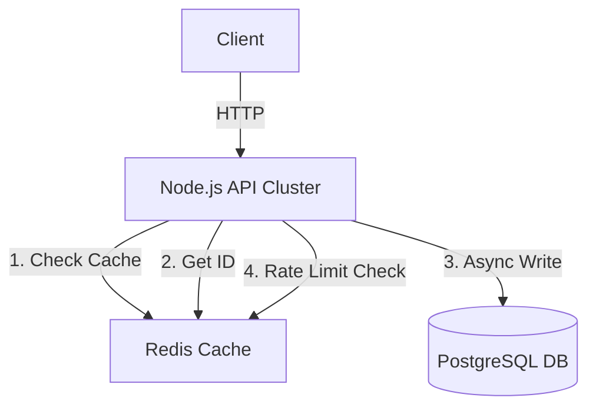

# 🚀 Scalable URL Shortener (System Design Implementation)

> A high-performance, distributed URL shortening service architected to handle high concurrency, modeled after systems like TinyURL and Bitly.


## 🏗 System Architecture

This project is not just a CRUD app; it demonstrates the resolution of race conditions, database locking, and read-heavy traffic optimization.



## ⚡ Key Engineering Decisions

### 1. Collision-Free ID Generation (Base62)
Instead of using random strings (which require checking the DB for collisions), I implemented a **Base62 encoding strategy** backed by **Redis Atomic Counters**.
- **Result:** O(1) ID generation time with zero collision probability.
- **Scale:** 6 characters allow for ~56 billion unique URLs.

### 2. High-Performance Read Path (Write-Through Caching)
To prevent the "Viral Link" problem (thundering herd), the system prioritizes Redis for reads.
- **Hit:** Returns in <5ms.
- **Miss:** Fetches from Postgres, populates Redis, and returns.
- **TTL:** Hot keys expire automatically to manage memory costs.

### 3. Asynchronous Analytics
Click tracking is decoupled from the redirect latency.
- We use a **"Fire-and-Forget"** pattern to increment click counters in Redis.
- Prevents database locking on the `urls` table during high-traffic spikes.

### 4. Distributed Rate Limiting
Implemented a Token Bucket algorithm using Redis to prevent abuse (e.g., DOS attacks or script flooding).

---

## 🛠 Tech Stack

- **Backend:** Node.js, Express, TypeScript
- **Frontend:** Next.js (React), Tailwind CSS
- **Database:** PostgreSQL (Relational integrity)
- **Cache/PubSub:** Redis (Performance & Counters)
- **DevOps:** Docker, Docker Compose

---

## 🚀 Getting Started

### Prerequisites
- Docker & Docker Compose

### Run via Docker (Recommended)
This spins up the API, Frontend, Postgres, and Redis simultaneously.

```bash
docker-compose up --build
```

- **Frontend:** `http://localhost:3000`
- **Backend API:** `http://localhost:5000`

---

## 🔌 API Endpoints

### `POST /shorten`
Creates a new short URL.
```json
// Request
{
  "longUrl": "https://www.google.com",
  "expiresIn": 24 // Optional (hours)
}
```

### `GET /:code`
Redirects to the original URL.
- **302 Found:** Used to track analytics (vs 301).
